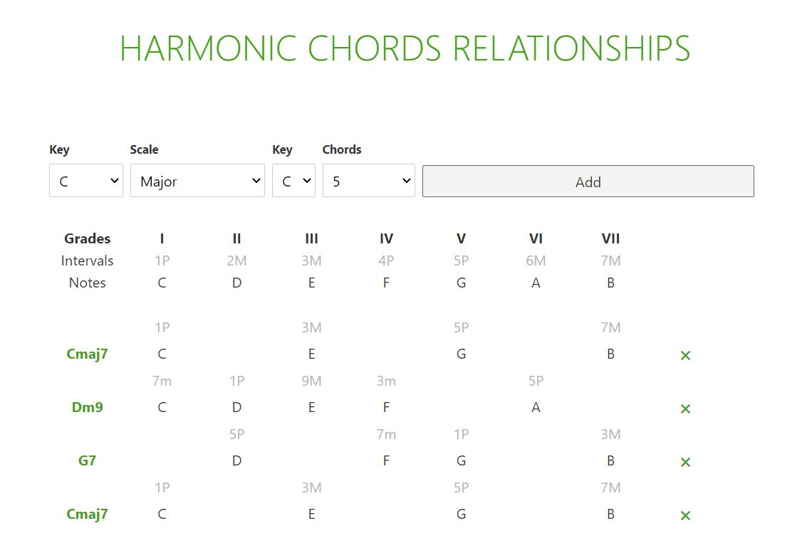

# TEST-SVELTE

Just a very first test with the FE framework [SVELTE](https://svelte.dev/) to develop a web app for studying the harmonic relationships among choosen chords. For a demo check [here](https://harmonic-relationships-2020.netlify.app/).

## Built With
- HTML5, CSS
- [SVELTE](https://svelte.dev/)
- [svelte-routing](https://github.com/EmilTholin/svelte-routing)
- [tonal](https://github.com/danigb/tonal)
- Rollup

## License
This project is licensed under the MIT License.
